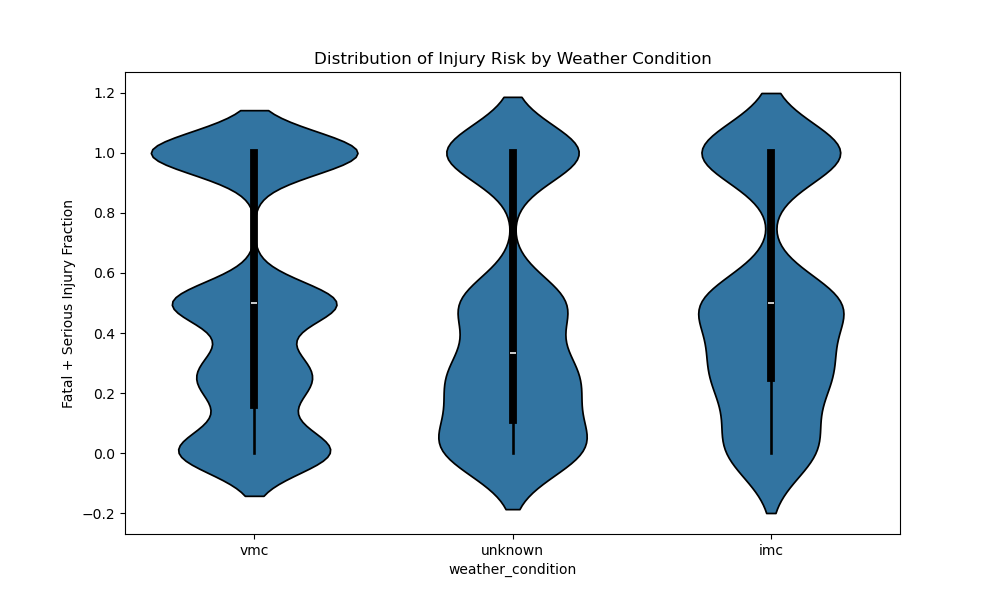

# Aviation Accident Analysis
Project Overview
This project analyzes aviation accident data to evaluatecommercial and passanger jet airline safety across different manufacturers and conditions. The goal is to identify safer aircraft makes based on injury severity  destruction outcomes and conditions that might be at play

Key Metrics
The analysis focuses on two main safety indicators:

1. Destruction Rate
  Proportion of accidents where the aircraft was completely destroyed.

2.Fatal + Serious Injury Fraction 
  Combined proportion of severe injuries per accident.

These metrics help measure not just how often accidents occur, but how severe they are.

Key Findings

 1.Injury Severity Distribution
     a. There were a total of 18008 injuries
     b. Most accidents result in low injury severity.
   However, the distribution is right-skewed, meaning a small number of cases lead to very severe outcomes.

 2.Aircraft Make Comparison
 Some aircraft manufacturers consistently show:
   a.Lower destruction rates
      like a large airplane of make aero commander registered 5 injuries and 1 accident occurence
   b. Lower fatal/serious injury fractions
      there was only one small airplane maketaylercraft which registered 2538 total fatal injuries and 2357 total number of accidents
   c. Based on injury rate and accident frequency
       safest small airplane is bombadier inc
       safest large airplane is de havilland
    visualization was done using  a bar graph
    d. mean fatal and serious injury fraction 
        safest small aircraft is bombadier inc
        safest large airplane is de havilland
    e. Distribution of injury rate
        safest small aircraft is bombadier inc
        safest large airplane is de havilland
    these aircrafts resulted in less servier injuries
         plot using violinplot and filtering 10 best safest aircrafts
    f. Evaluating rate of destruction
        safest small aircraft is luscombe
        safest large airplane is de bombadier inc
3. Weather Impact
      VMC - shows the lowest injury severity.
      thus it is the safest weather 
4. purpose of flight
      I found out that skydiving is the safest purpose to flight

Visualizations

Distribution of Injury Risk by Weather Condition

Distribution of injury rate

Recommendations

Prefer aircraft makes with:
  Low destruction rates
  Low fatal/serious injury fractions
  Low injury rate and accident frequency 

Be cautious with:
    Makes with small sample sizes (less reliable conclusions)

Limitations

Some aircraft have fewer recorded accidents may affect reliability
Unknown weather conditions introduce uncertainty
So many missing values which had to be imputed
data were skewed
Results do not account for aircraft usage (training, private, commercial)

Conclusion

Aircraft safety varies significantly across manufacturers and conditions. While most accidents result in minor outcomes, a small subset leads to severe consequences. Identifying aircraft with consistently lower severity metrics provides valuable insight for safer decision-making.
I will recommend :
   for small aircraft make, 
        bombadier inc is the safest
   for large aircraft make, 
        de havilland is the safest
Tools Used
    Python (Pandas, NumPy)
    Matplotlib / Seaborn
    Jupyter Notebook
